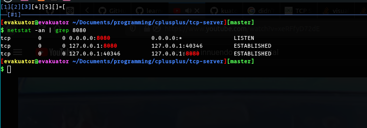

Simple tcp server that can be run in a local network.
To be able to send messages from one network to another, it is necessary to enable
port forwarding on your default gateway a.k.a router. Map the router's ip to server ip.
Port forwarding is necessary because router is the device which holds the public ip.
All the other devices are using private local IPs.

# TODO
1. Implement a chat using this tcp server
2. Build a simple http server based on this tcp server

Servers running

Server first initializes LISTENING socket. Then client tries to connet, 
socket accepts the connection and creates new ESTABLISHED socket. The client side,
after getting accept message from the server, also creates ESTABLISHED socket.

On the server side, the listening socket is associated with only a local IP and port and is in the LISTEN state.
In contrast, accepted sockets on the server (as well as connected sockets on the client) are identified by a local IP and port as well as a remote IP and port and is in the ESTABLISHED state.
On the client side, it doesn't matter that the server uses a listening socket separate from the connected socket. By the time the client returns from connect, the server has returned from accept and the socket descriptors returned from each can communicate with each other.

Running `netstat -an` shows us that stated above is actually true.

